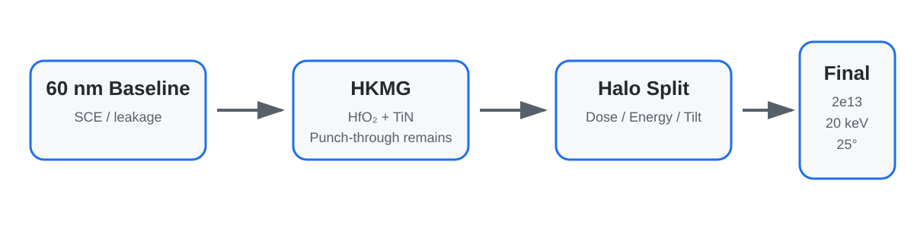

# 60 nm NMOS SCE Suppression with HKMG and Halo Doping

60 nm급 NMOS에서 나타나는 **short-channel effect(SCE)와 off-state leakage**를 줄이기 위해, HfO₂ 기반 HKMG와 Halo Doping을 단계적으로 도입하고 Sentaurus TCAD로 조건을 비교한 프로젝트입니다.

HKMG 단독 적용에서 나타난 심한 punch-through 문제를 확인한 뒤, Halo dose / energy / tilt를 split하여 누설 전류와 스위칭 특성의 균형점을 찾았습니다. Nitride sidewall spacer는 공정 흐름에 포함했으며, 본 프로젝트에서 spacer 자체를 sweep한 것은 아닙니다.

**Summary:**  
A 60 nm NMOS TCAD project evaluating HfO₂-based HKMG and halo implantation for short-channel-effect suppression. The final halo condition was selected by balancing leakage control, subthreshold behavior, and drive-current retention.

---

## Results at a Glance

| Item | Result |
|---|---:|
| Baseline gate length | 60 nm |
| High-k dielectric | HfO₂ |
| Final Halo Dose | `2e13 cm^-2` |
| Final Halo Energy | `20 keV` |
| Final Halo Tilt | `25°` |
| Final Ioff | `1.465e-15 A/µm` |
| Final Ion/Ioff | `1.41e12` |
| Final SS | `68–69 mV/dec` |
| HKMG-only Ion/Ioff | `0.89` |



---

## What Was Implemented

- 60 nm NMOS baseline에서 SCE와 off-state leakage 문제 확인
- SiO₂ interfacial layer + HfO₂ high-k + TiN gate stack 구성
- HKMG 단독 적용 후 punch-through와 스위칭 특성 붕괴 확인
- Boron halo implantation을 4-direction rotation으로 적용
- Halo Dose / Energy / Tilt parameter split 및 경향성 분석
- Nitride sidewall spacer 형성 후 deep Source/Drain implantation 진행
- `Vd = 0.05 V`와 `1.0 V`에서 Id–Vg 특성 계산
- SVisual에서 Vth, SS, DIBL, Ion/Ioff 자동 extraction 로직 구성

---

## Read the Project

| Page | Description |
|---|---|
| [Project Page](./index.html) | 프로젝트 전체 흐름과 핵심 결과 |
| [Detailed Navigation](./guide/00_navigation.md) | 세부 문서 안내 |
| [Project Overview](./guide/01_project_overview.md) | 문제 정의와 프로젝트 목표 |
| [Baseline & SCE](./guide/02_baseline_and_sce.md) | 60 nm baseline과 SCE 문제 |
| [HKMG Design](./guide/03_hkmg_design.md) | HfO₂/TiN gate stack과 HKMG-only 결과 |
| [Halo Optimization](./guide/04_halo_optimization.md) | Dose / Energy / Tilt 최적화 |
| [Spacer & Process Flow](./guide/05_spacer_and_process_flow.md) | spacer 및 S/D 공정 흐름 |
| [Electrical Simulation](./guide/06_electrical_simulation.md) | SDevice/SVisual 평가 조건 |
| [Final Results](./guide/07_final_results.md) | 최종 조건과 성능 |
| [Limitations](./guide/08_limitations_and_next_steps.md) | 자료 불일치와 해석 범위 |
| [Study Notes](./study/README.md) | 핵심 공정 개념 정리 |
| [Appendix](./appendix/README.md) | source consistency notes |
| [Report Scope](./report/README.md) | 원본 자료 및 공개 범위 |

---

## Source Code

| File | Description |
|---|---|
| [`source/sprocess/nmos_hkmg_halo_process.cmd`](./source/sprocess/nmos_hkmg_halo_process.cmd) | HfO₂/TiN gate, halo, LDD, spacer, S/D 공정 |
| [`source/sdevice/nmos_idvg_des.cmd`](./source/sdevice/nmos_idvg_des.cmd) | 두 drain bias 조건의 Id–Vg simulation |
| [`source/svisual/extract_metrics.tcl`](./source/svisual/extract_metrics.tcl) | Vth, SS, DIBL, Ion/Ioff extraction |

> Source files were transcribed from the submitted code PDF. Line wrapping was normalized for readability without intentionally changing the simulation logic.

---

## Repository Structure

```text
TCAD-NMOS-HKMG-Halo-Optimization/
├── README.md
├── index.html
├── index.md
├── _config.yml
├── guide/
├── figures/
├── assets/
├── study/
├── references/
├── appendix/
├── source/
├── results/
└── report/
```

---

## Project Scope

2026년 5–6월 반도체집적공정 교과목의 팀 프로젝트를 포트폴리오 형태로 재구성했습니다. 최종 수치와 조건은 제출 발표자료 및 코드 PDF에서 확인 가능한 내용만 사용했습니다.

본 프로젝트의 parameter search는 정해진 split 조건을 비교한 결과이며, 모든 변수 조합을 탐색한 global optimization으로 해석하지 않습니다.

---

[← Back to Subin Joo's GitHub Portfolio](https://github.com/soybeanmilk0514-jpg)
